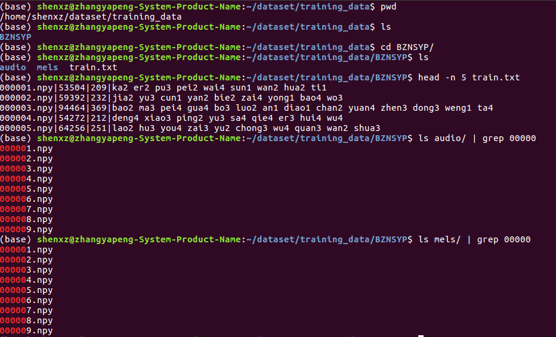

# Tacotron 2 And WaveRnn For PyTorch

This repository provides a script and recipe to train Tacotron 2 and WaveRnn
models to achieve state of the art accuracy.

## Table of Contents
* [Model overview](#model-overview)
   * [Model architecture](#model-architecture)
* [Setup](#setup)
   * [Requirements](#requirements)
   * [Prepare dataset](#prepare-dataset)
   * [Training Tacotron2](#training-tacotron2)
   * [Training WaveRnn](#training-wavernn)
   * [Start inference](#start-inference)

## Model overview

This text-to-speech (TTS) system is a combination of two neural network
models:

* a modified Tacotron 2 model from the [Natural TTS Synthesis by Conditioning WaveNet on Mel Spectrogram Predictions](https://arxiv.org/abs/1712.05884)
paper
* a modified WaveRnn model from the [Efficient Neural Audio Synthesis](https://arxiv.org/abs/1802.08435v1) paper

The Tacotron 2 and WaveRnn models form a text-to-speech system that enables
users to synthesize natural sounding speech from raw transcripts without
any additional information such as patterns and/or rhythms of speech.


### Model architecture


Figure 1. Architecture of the Tacotron 2 model. Taken from the
[Tacotron 2](https://arxiv.org/abs/1712.05884) paper.


Figure 2. Architecture of the WaveRnn model.


## Setup

The following section lists the requirements in order to start training the
Tacotron 2 and WaveRnn models.

### Requirements

Under your python3 env, install the dependencies.
```bash
pip install -r requirement.txt
```

### Prepare dataset

Download and preprocess the  [dataset](https://www.data-baker.com/open_source.html), and then its structure should be as Fig. 3.


Figure 3. Structure of the dataset.

### Training Tacotron2
```bash
train_tacotron2.py -o logs --init-lr 1e-3 --final-lr 1e-5 --epochs 300 -bs 32 --weight-decay 1e-6 --log-file nvlog.json --dataset-path /home/shenxz/dataset/training_data --training-anchor-dirs BZNSYP
```
### Training WaveRnn
(1) When tacotron2 is trained completely, to generate gta files, which are part of inputs for WaveRnn.
```bash
gta.py --checkpoint logs/checkpoint_0200.pt
```

(2) Put the gta output to the below gta folder, and put the files in previously mentioned audio directory to below quant folder.
```bash
./data
  --voc_mol
    --gta
    --quant
```
(3) To train WaveRnn.
```bash
train_wavernn.py --gta
```
### Start inference
After you have trained the Tacotron 2 and WaveRnn models, you can perform
inference using the respective checkpoints that are passed as `--tacotron2`
and `--WaveRnn` arguments.

   To run inference issue:

   ```bash
   python inference.py --tacotron2 <Tacotron2_checkpoint> --WaveRnn <WaveRnn_checkpoint> -o output/ -i phrases/phrase.txt
   ```
   You can also use default param and run as server, and input text base on GUI:
   ```bash
   python manage.py
   python start_gui.py
   ```
   The speech is generated from lines of text in the file that is passed with
   `-i` argument. The number of lines determines inference batch size. The output 
   audio will be stored in the path specified by the `-o` argument.

